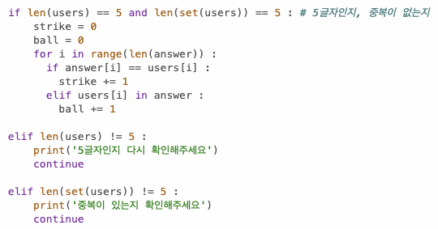

# AIFFEL Campus Online Code Peer Review Templete
- 코더 : 차병곤
- 리뷰어 : 정범준


# PRT(Peer Review Template)
- [x]  **1. 주어진 문제를 해결하는 완성된 코드가 제출되었나요?**
	
	문제의 요구사항을 완벽하게 충족했습니다.
	-정답 숫자 5개 생성
	-사용자에게 5개 숫자 입력 받기
	-스트라이크, 볼 판별
    
- [x]  **2. 전체 코드에서 가장 핵심적이거나 가장 복잡하고 이해하기 어려운 부분에 작성된 
주석 또는 doc string을 보고 해당 코드가 잘 이해되었나요?**
    
	해당 코드가 하는 일이 무엇인지 주석으로 잘 설명했습니다.

	
        
- [x]  **3. 에러가 난 부분을 디버깅하여 문제를 해결한 기록을 남겼거나
새로운 시도 또는 추가 실험을 수행해봤나요?**
  
	숫자 5개를 입력받을 때,
	5자리 숫자가 맞는지와 중복 숫자가 있는지를 체크하는 기능을 넣었습니다.
	


        
- [ ]  **4. 회고를 잘 작성했나요?**

	배운점이나 아쉬운점에 대한 기록은 없습니다.
	과제가 너무 단순해서 그런 것 같습니다.

        
- [x]  **5. 코드가 간결하고 효율적인가요?**
    
	코드가 아주 간결하고 파이썬에서만 가능한 문법이 쓰였습니다.
	(C, JAVA 에서는 불가능한 문법)


# 회고(참고 링크 및 코드 개선)
```
# 리뷰어의 회고를 작성합니다.
# 코드 리뷰 시 참고한 링크가 있다면 링크와 간략한 설명을 첨부합니다.
# 코드 리뷰를 통해 개선한 코드가 있다면 코드와 간략한 설명을 첨부합니다.
```